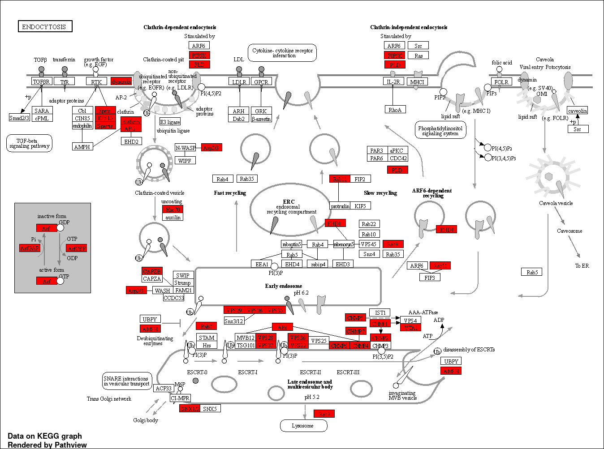

# Combined features regulate the plant stress response pathways

**Supplementary Table XX2:** KEGG Pathway enrichment for all loci (9135) identified as part of all ML model.

<table data-header-hidden><thead><tr><th width="260"></th><th width="108"></th><th width="115"></th><th width="109"></th><th></th></tr></thead><tbody><tr><td><strong>Enrichment FDR</strong></td><td><strong>nGenes</strong></td><td><strong>Pathway Genes</strong></td><td><strong>Fold Enrichment</strong></td><td><strong>Pathways</strong></td></tr><tr><td>1.1E-05</td><td>35</td><td>53</td><td>2</td><td>Porphyrin and chlorophyll metabolism</td></tr><tr><td>3.2E-06</td><td>40</td><td>61</td><td>2</td><td>Citrate cycle (TCA cycle)</td></tr><tr><td>4.5E-04</td><td>25</td><td>39</td><td>1.9</td><td>Circadian rhythm</td></tr><tr><td>3.6E-06</td><td>47</td><td>76</td><td>1.9</td><td>Photosynthesis</td></tr><tr><td>5.6E-06</td><td>47</td><td>77</td><td>1.8</td><td>Glyoxylate and dicarboxylate metabolism</td></tr><tr><td>1.5E-04</td><td>40</td><td>69</td><td>1.8</td><td>Carbon fixation in photosynthetic organisms</td></tr><tr><td>4.2E-14</td><td>153</td><td>269</td><td>1.7</td><td>Carbon metabolism</td></tr><tr><td>2.4E-04</td><td>43</td><td>77</td><td>1.7</td><td>Inositol phosphate metabolism</td></tr><tr><td>3.7E-05</td><td>54</td><td>97</td><td>1.7</td><td>Glycerophospholipid metabolism</td></tr><tr><td>3.7E-05</td><td>54</td><td>97</td><td>1.7</td><td>Pyruvate metabolism</td></tr><tr><td>4.5E-04</td><td>40</td><td>72</td><td>1.7</td><td>2-Oxocarboxylic acid metabolism</td></tr><tr><td>1.4E-07</td><td>87</td><td>157</td><td>1.7</td><td>Endocytosis</td></tr><tr><td>2.5E-06</td><td>75</td><td>137</td><td>1.7</td><td>Oxidative phosphorylation</td></tr><tr><td>5.4E-13</td><td>170</td><td>315</td><td>1.6</td><td>Ribosome</td></tr><tr><td>5.0E-05</td><td>60</td><td>112</td><td>1.6</td><td>RNA degradation</td></tr><tr><td>1.8E-09</td><td>132</td><td>249</td><td>1.6</td><td>Biosynthesis of cofactors</td></tr><tr><td>5.0E-05</td><td>63</td><td>119</td><td>1.6</td><td>Glycolysis / Gluconeogenesis</td></tr><tr><td>9.0E-09</td><td>126</td><td>240</td><td>1.6</td><td>Biosynthesis of amino acids</td></tr><tr><td>4.4E-04</td><td>65</td><td>131</td><td>1.5</td><td>Amino sugar and nucleotide sugar metabolism</td></tr><tr><td>8.3E-30</td><td>606</td><td>1243</td><td>1.5</td><td>Biosynthesis of secondary metabolites</td></tr></tbody></table>

KEGG pathview shows nodes identified by enrichment analysis.

<figure><figcaption>
<strong>Supplementary Figures XXXXXXX:</strong> KEGG pathway showing biosynthesis of amino acids
</figcaption></figure>

**Supplementary Figures XXXXXXX:** KEGG pathway showing biosynthesis of amino acid and nucleotide sugars metabolism.&#x20;

<figure><figcaption>
<strong>Supplementary Figures XXXXXXX:</strong> KEGG pathway showing chlorophyll metabolism.
</figcaption></figure>

**Supplementary Figures XXXXXXX:** KEGG pathway showing chlorophyll metabolism.

<figure><figcaption>
<strong>Supplementary Figures XXXXXXX:</strong> KEGG pathway showing circadian rhythm.
</figcaption></figure>

**Supplementary Figures XXXXXXX:** KEGG pathway showing circadian rhythm.

<figure><figcaption>
<strong>Supplementary Figures XXXXXXX:</strong> KEGG pathway showing oxidative phosphorylation and endosome trafficking.
</figcaption></figure>

**Supplementary Figures XXXXXXX:** KEGG pathway showing oxidative phosphorylation and endosome trafficking.

<figure><figcaption>
<strong>Supplementary Figures XXXXXXX:</strong> KEGG pathway showing the TCA cycle and pyruvate metabolism.
</figcaption></figure>

**Supplementary Figures XXXXXXX:** KEGG pathway showing the TCA cycle and pyruvate metabolism.

<figure><figcaption>
<strong>Supplementary Figures XXXXXXX:</strong> KEGG pathway showing poyphyrin metabolism.
</figcaption></figure>

More available upon request

**Supplementary Figures XXXXXXX:** KEGG pathway showing the glycolysis/glycogenesis, and glyoxylate and dicarboxylate metabolism.

**Supplementary Figures XXXXXXX:** KEGG pathway showing RNA degradation and Ribosome composition.

**Supplementary Figures XXXXXXX:** KEGG pathway showing biosynthesis of cofactors

**Supplementary Figures XXXXXXX:** KEGG pathway showing primary carbon metabolism.
