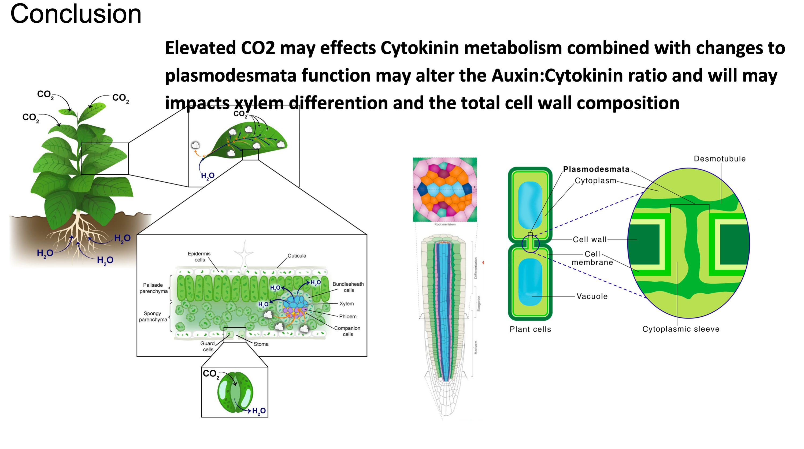

# Conclusion and future work.

Conclusion: Machine Learning Reveals Molecular Mechanisms and Adaptive Responses of Plants to Spaceflight Conditions

The application of machine learning techniques has enabled us to identify genetic features associated with treatment models, providing insights into complex molecular mechanisms underlying plant responses. Moreover, it emphasizes how these findings connect with broad cellular processes such as changes in nuclear import, ribosomal function, RNA splicing, protein degradation, hormonal signaling, plastid function, plasmodesmata composition leading to structural and biochemical alterations within plants cell vacuoles and their walls due to experiencing spaceflight related stimuli. This analysis also highlighted the role of changes in the plasmodesmata as an important part of the plants adaptive capacity to overcome stressors encountered during spaceflight. The validation using independent datasets and enrichment analysis adds credibility while emphasizing how machine learning can enhance our comprehension of gene expression patterns related to treatment models. Interestingly these results highlight a group of unnamed proteins that can be used to identify a spaceflight response signature and likely part of the plant's natural adaptation mechanisms responding to increased oxidative stress and elevated CO2. Overall, these methods and this research carries significant implications for comprehending plant responses to the spaceflight environment and highlight how selecting studies related to focused questions can provide more precise insights.

<figure><figcaption></figcaption></figure>

**Future work?**

Could compare the feature tables to the results from DESeq2 for each linear model that was in the matrix. GLDS-37, -38, -120, -121, more/others from the MATRIX paper?
