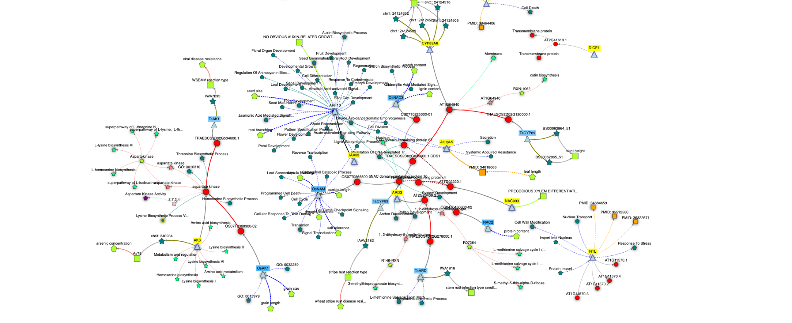
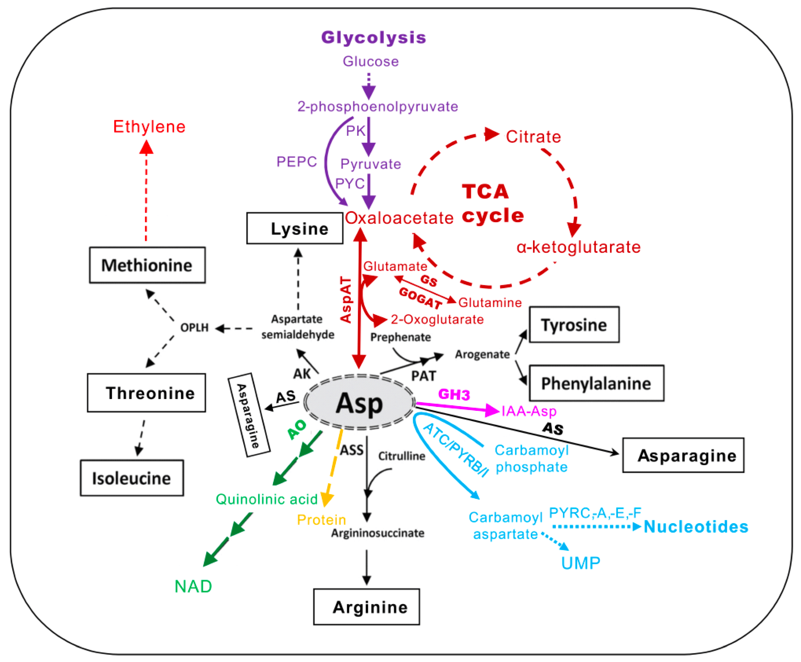
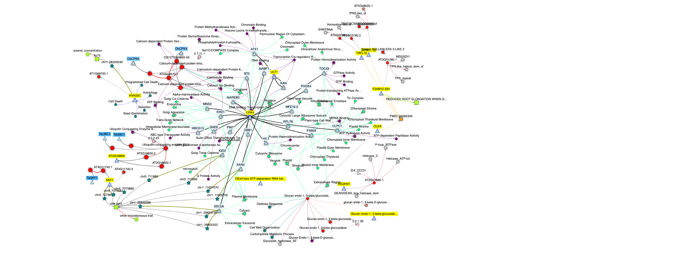
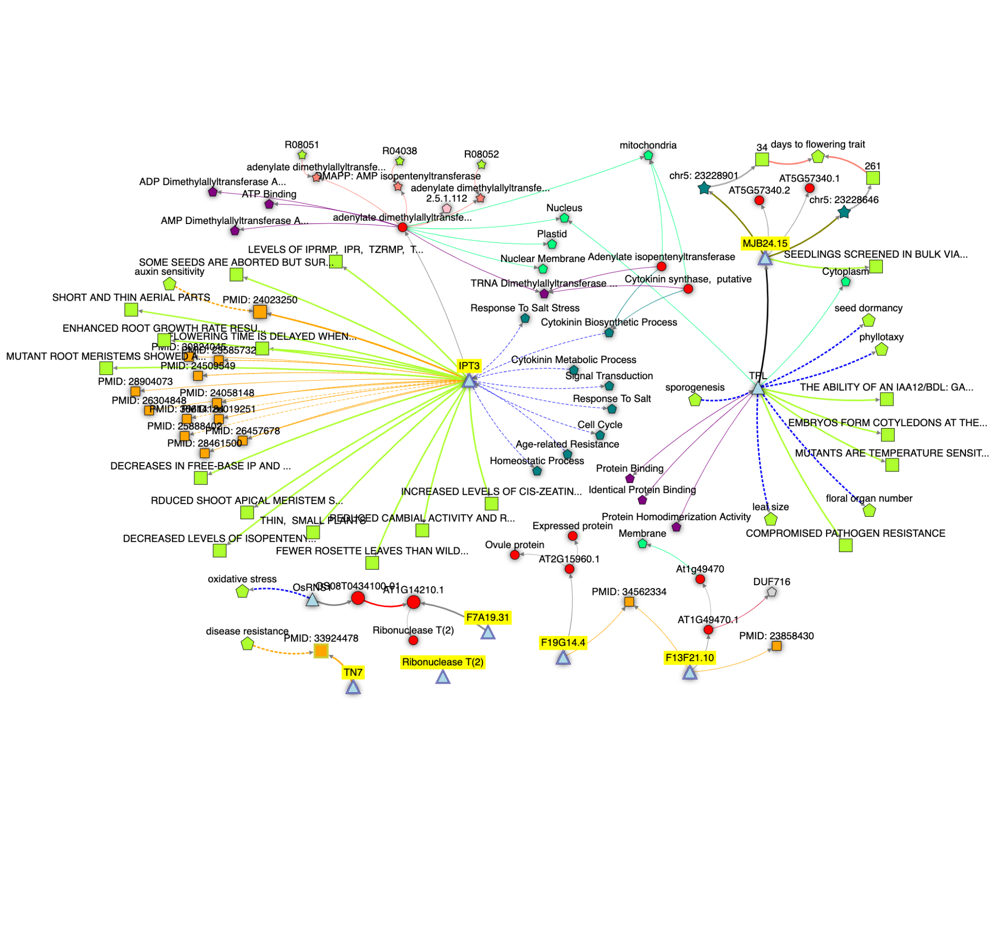

# Genetic results

## Kneminer Knowledge Network Analysis: Molecular Connections in Plant Physiology

**Figure XXX3:** Knowledge network connecting the top 10 features identified by the JADBio precision model. Network size: 173 Nodes and 185 Edges. This analysis included 10 loci AT1G64940, AT3G02020, AT1G11570, AT5G57420, AT1G02220, AT2G38530, AT2G26400, AT3G18260, AT5G07190, AT2G41610.

 


[https://knetminer.com/beta/knetspace/network/57bb9cf4-9b58-448d-a793-fc9396f2ef1e](https://knetminer.com/beta/knetspace/network/57bb9cf4-9b58-448d-a793-fc9396f2ef1e)


### Molecular Connections

This document elucidates the intricate molecular connections between a select group of loci: IAA33, ARD3, NAC003, CYP89A6, ATS3, AK3, RTNLB9, DICE, NTL, and LP2. These loci have been identified for their pivotal roles in various physiological processes such as aspartate phosphorylation, elongation, salicylic acid-dependent systemic resistance, and nuclear transport in plants.

The investigation into the molecular interactions among different loci facilitates a deeper understanding of plant physiological processes. The loci IAA33 is directly linked to ARF10, establishing a critical connection in the regulatory networks controlling plant growth and stress responses.

#### Aspartate Phosphorylation and Elongation

* **IAA33** is linked with **ARF10**, playing a significant role in the regulation of aspartate phosphorylation.
* **ARD3** and **NAC003** contribute to cellular elongation processes, potentially interacting with pathways associated with aspartate phosphorylation.

#### Salicylic Acid-Dependent Systemic Resistance

* **CYP89A6** and **ATS3** have been implicated in pathways leading to salicylic acid-dependent systemic resistance, crucial for the plant's defense mechanism.
* **AK3** and **RTNLB9** further connect to these pathways, suggesting a complex network of interactions facilitating systemic resistance.

#### Nuclear Transport

* **DICE** and **NTL** are central to the processes of nuclear transport, indicating a crucial role in cellular regulation and signaling.
* **LP2**, identified as a lipid transfer protein, may influence membrane dynamics and thus indirectly affect nuclear transport processes.

### Conclusion

The Kneminer knowledge network reveals a complex web of molecular interactions involving IAA33, ARD3, NAC003, CYP89A6, ATS3, AK3, RTNLB9, DICE, NTL, and LP2. These connections underscore the multifaceted roles these loci play in aspartate phosphorylation, elongation, salicylic acid-dependent systemic resistance, and nuclear transport. Understanding these connections not only enriches our comprehension of plant physiology but also opens new avenues for genetic manipulation to enhance plant resilience and growth.

## Analysis of Key Genes in Plant Biology: A Network Perspective

**Figure XXXX4:** Feature 2 summary, Knetminer network size: 169 Nodes and 237 Edges. This analysis included 10 loci;AT4G09570, AT2G18600, AT4G28190, AT2G47680, AT5G56590, AT4G11740, AT1G69700, AT5G48020, AT3G51280, and AT5G03780.


[https://knetminer.com/beta/knetspace/network/4f76024c-14c0-49a7-a297-6e5edb792616](https://knetminer.com/beta/knetspace/network/4f76024c-14c0-49a7-a297-6e5edb792616)


###

In plant biology, the intricate molecular mechanisms regulating processes such as calcium signaling, transcriptional regulation, and germination/secretion are pivotal for understanding plant development and responses to environmental stimuli. This document provides an overview of a knowledge network that interconnects several crucial loci, namely CPK4, ULt1, HVA22C, SAY1, At2G1860, DExH-box RNA helicase, C3H31, TRFL10, MDN11.10, OLE9, and a glucan endo- 1,3-beta-glucosidase. These entities are implicated in various biological processes, including but not limited to calcium signaling, transcriptional regulation, and the hydrolysis of glucans.

###

Plants exhibit a variety of complex signaling pathways and regulatory mechanisms that ensure their survival, growth, and reproduction. Integral to these pathways are proteins and enzymes that facilitate signal transduction, gene expression, and metabolic processes. The loci under discussion are associated with critical biological functions, such as calcium signaling, essential for transducing external stimuli into cellular responses; transcriptional regulation, governing gene expression; and germination/secretion processes vital for plant development.

### Knowledge Network Insights

* **CPK4 and ULt1** are involved in calcium signaling pathways, acting as key players in translating calcium changes into biochemical signals.
* **HVA22C and SAY1**, along with **At2G1860**, play significant roles in transcriptional regulation, influencing gene expression patterns essential for plant development and stress responses.
* **DExH-box RNA helicase and C3H31** represent two ATP-binding helicase genes that are integral in RNA processing and modification, impacting mRNA splicing and stability.
* **TRFL10, MDN11.10, and OLE9** are implicated in germination/secretion processes, highlighting their importance in early plant development and adaptation.
* **A glucan endo- 1,3-beta-glucosidase** functions in breaking down glucans, important for cellular wall restructuring during growth or stress responses.

### Conclusion

The interconnectedness of these loci within the plant molecular network sheds light on complex regulatory mechanisms governing plant life. By understanding the roles and relationships of CPK4, ULt1, HVA22C, SAY1, At2G1860, DExH-box RNA helicase, C3H31, TRFL10, MDN11.10, OLE9, and glucan endo- 1,3-beta-glucosidases, researchers can further dissect the molecular underpinnings of plant biology. This knowledge forms the basis for innovations in genetic engineering, crop improvement, and sustainable agriculture practices.

Add light picture or diagram to highlight either CPK/ calcium signaling or glucan endo glucosidase metabolism

## Analysis of the Kneminer Knowledge Network: Linkage between PIT3 and Cytokinin-Related Phenotypes

**Figure XXXXX5:** Network size: 97 Nodes and 103 Edges. Loci from features 0, 3, 4, 5, 7. This analysis include 7 loci; AT3G63110, AT5G57340, AT1G14210, AT1G72900, AT1G49470, AT2G15960, and AT1G14210.

<figure><figcaption>
<a href="https://knetminer.com/beta/knetspace/network/20833315-8604-45d0-8a1b-5776ce62922d">https://knetminer.com/beta/knetspace/network/20833315-8604-45d0-8a1b-5776ce62922d</a>
</figcaption></figure>



The Kneminer knowledge network offers a comprehensive mapping of genetic interactions and phenotypic outcomes, focusing on the interconnection between PIT3 and its effects on cytokinin-related phenotypes. This analysis extends to include several lesser-known loci, which, despite the scarcity of detailed information, are recognized for their involvement in critical biological processes. These include oxidative stress response, disease resistance mechanisms, modulation of flowering time, and the presence of unidentified functional domains within membrane structures. The loci of interest are ribonuclease T2, TN7, F19G14.4, F13F21.10, and MJB24.15.

### Identified Loci and Their Implicated Roles

* **Ribonuclease T2**: Noted for its potential involvement in the oxidative stress response, suggesting a role in cellular defense mechanisms against environmental stress factors.
* **TN7**: Linked to disease resistance, indicating its possible function in the plant's innate immune system against a variety of pathogens.
* **F19G14.4**: A locus with unclear implications, yet it is hypothesized to play a role in the regulation of flowering time, a critical factor in plant development and reproduction.
* **F13F21.10**: Characterized by the presence of a domain of unknown function within the membrane, suggesting a potential role in signal transduction or intracellular transport processes.
* **MJB24.15**: Like F13F21.10, this locus is distinguished by an unidentified functional domain within the membrane, pointing towards a possible involvement in key cellular activities yet to be elucidated.

### Conclusion

The Kneminer knowledge network serves as a vital tool in unraveling the complex genetic underpinnings of plant phenotypes. The connections between PIT3 and cytokinin-related phenotypes underscore the intricate interplay of genetic factors in plant growth and development. The highlighted loci, despite their current lack of detailed understanding, represent promising areas for future research endeavors. Focusing on these loci could unravel new insights into plant biology, paving the way for advancements in crop production, disease resistance, and stress tolerance.

**Table XXX1:** Loci identified by JABBio not including feature 1 (Tissue/GLDS) and feature 6 (PD group) as they contain 8888 and 222 genes respectively. Complete lists are found in supplementary table 1.

<table data-header-hidden><thead><tr><th width="159"></th><th width="421"></th><th></th></tr></thead><tbody><tr><td><strong>Gene Name</strong></td><td><strong>Gene Description: + “</strong><em><strong>note from TAIR</strong></em><strong>”</strong></td><td><strong>Feature</strong></td></tr><tr><td>AT5G57340</td><td><strong>NULL</strong>; <em>“ras guanine nucleotide exchange factor Q-like protein interacts with TOPLESS”</em></td><td>Feature 0</td></tr><tr><td>AT5G48020</td><td><strong>NULL</strong>; 2-oxoglutarate (2OG) and Fe(II)-dependent oxygenase protein; “<em>Culligan et al., 2007</em>”</td><td>Feature 2</td></tr><tr><td>AT5G56590</td><td><strong>NULL</strong>; O-Glycosyl hydrolases family 17 protein; “<em>Cellwall</em>, <em>plasma membrane, plastid, carbohydrate metabolism</em>”</td><td>Feature 2</td></tr><tr><td>HVA22C</td><td>HVA22C;“<em>nucleus, plasmodesma, hyperosmotic salinity response, response to ABA, response to drought</em>”</td><td>Feature 2</td></tr><tr><td>AT2G18600</td><td><strong>NULL</strong>;Ubiquitin-conjugating enzyme; “<em>protein neddylation and Culligan et al (2006)</em>”</td><td>Feature 2</td></tr><tr><td>TRFL10</td><td>TRF-like 10; “<em>Literature links to telomeres and radiation via Culligan et al (2006)</em>”</td><td>Feature 2</td></tr><tr><td>AT3G51280</td><td><strong>NULL</strong>;Tetratricopeptide repeat (TPR)-like; “<em>literature links to meristem maintenance and DELLA signaling</em>”</td><td>Feature 2</td></tr><tr><td>ULT1</td><td>ULTRAPETALA; Developmental regulator “<em>adaxial-abaxial polarity axis pattern and the apical-basal axis”</em></td><td>Feature 2</td></tr><tr><td>AT2G47680</td><td><strong>NULL</strong>;“<em>zinc finger (CCCH type) helicase family protein, involved in rRNA maturation in nucleolus</em>”</td><td>Feature 2</td></tr><tr><td>SAY1</td><td>SAY1; Ubiquitin-like superfamily protein; “<em>Literature links to radiation via Culligan et al (2006)</em>”</td><td>Feature 2</td></tr><tr><td>DUF716</td><td>Domain of Unknown Function (DUF716); “<em>involved in the response to light stimulus</em>”</td><td>Feature 3</td></tr><tr><td>AT1G72900</td><td><strong>NULL</strong>; Toll-Interleukin-Resistance (TIR) domain-containing protein; “<em>Cellular response to hypoxia</em>”</td><td>Feature 4</td></tr><tr><td>AT2G15960</td><td><strong>NULL</strong>; ”<em>Nuclear pore interaction</em>, <em>RNA decreased in response to proline and increase ammonia, nitrate and urea</em>.”</td><td>Feature 5</td></tr><tr><td>AT1G14210</td><td><strong>NULL</strong>; Ribonuclease T2 family protein; “<em>RNA cleavage in cytoplasm, secretory vesicle and extracellular region</em>”</td><td>Feature 7</td></tr><tr><td>IPT3</td><td>Isopentenyltransferase3; “<em>cytokinin biosynthetic, mitochondrion, chloroplast, nucleus, plastid</em>”</td><td>Feature 7</td></tr><tr><td>NAC003</td><td>NAC domain containing protein 3; “<em>Controls the balance of xylem formation and cambial cell divisions</em>”</td><td>Precision</td></tr><tr><td>AT1G70420</td><td>Protein of unknown function (DUF1645); “<em>response to oxidative stress</em>”</td><td>Precision</td></tr><tr><td>AT2G03850</td><td><strong>NULL</strong>; Late embryogenesis abundant protein (LEA) family protein; “r<em>esponse to ABA, located in chloroplast</em>”</td><td>Precision</td></tr><tr><td>CYP89A6</td><td>Cytochrome P450, family 87, subfamily A, polypeptide 6; “<em>heme binding located in mitochondria</em>”</td><td>Precision</td></tr><tr><td>AT1G12100</td><td><strong>NULL</strong>; Bifunctional inhibitor/lipid-transfer/seed storage 2S albumin superfamily; “<em>Literature link to salt stress</em>”</td><td>Precision</td></tr><tr><td>ARD3</td><td>Acireductone dioxygenase 3; “<em>methionine metabolic process, linked to ethylene metabolism</em>”</td><td>Precision</td></tr><tr><td>LTP2</td><td>Lipid Transfer Protein 2; “<em>lipid transfer between membranes and maintaining the cuticle-cell wall interface</em>”</td><td>Precision</td></tr><tr><td>DICE1</td><td>DICE: “<em>Defect in cell elongation1, ER, Mitochondria, cell wall organization/expansion, Xylem maturation”</em></td><td>Precision</td></tr><tr><td>AK3</td><td>Aspartate kinase 3; <em>“chloroplast and involved in the response to light in guard cells”</em></td><td>Precision</td></tr><tr><td>CYP72A14</td><td>Cytochrome P450, family 72, subfamily A, polypeptide 14; “<em>Heme/Iron binding with oxygen integration</em>”</td><td>Precision</td></tr><tr><td>AT3G18260</td><td><strong>NULL</strong>; Reticulon family; “<em>found in ER tubules near plastids</em>, <em>expressed in hypocotyl &#x26; mature root vasculature</em>”</td><td>Precision</td></tr><tr><td>AT3G19200</td><td><strong>NULL</strong>; “<em>Root expressed, RNA metabolism, epidermis development, morphogenesis, response to bacterium</em>”</td><td>Precision</td></tr><tr><td>NTL</td><td>NTF2-like; “<em>nuclear pore central transport channel</em>”</td><td>Precision</td></tr><tr><td>CPK4</td><td>Calcium-dependent Protein Kinase 4; “<em>Phosphorylates ABA responsive transcription factors ABF1 and ABF4”</em></td><td>Precision</td></tr><tr><td>AT4G16920</td><td><strong>NULL</strong>; Disease resistance protein (TIR-NBS-LRR class) family; “<em>8 splicing variants</em>”</td><td>Precision</td></tr><tr><td>AT4G32080</td><td><strong>NULL</strong>; “<em>Located in mitochondria and literature links to response to cold; response to osmotic stress</em>”</td><td>Precision</td></tr><tr><td>AT4G37220</td><td><strong>NULL</strong>; Cold acclimation protein WCOR413 family; “<em>response to sucrose, functions in mitochondria</em>”</td><td>Precision</td></tr><tr><td>AT5G03010</td><td>Galactose oxidase/kelch repeat superfamily protein; “<em>located in mitochondria</em>”</td><td>Precision</td></tr><tr><td>AT5G05900</td><td>UDP-Glycosyltransferase; “<em>quercetin 3 &#x26; 7-O-glucosyltransferase activity</em>”</td><td>Precision</td></tr><tr><td>ATS3</td><td>Seed gene 3; “<em>literature link to potential role in insect resistance and ethylene signaling</em>”</td><td>Precision</td></tr><tr><td>AT5G22555</td><td><strong>NULL;</strong> “<em>chloroplast, literature links linked to JA and Cytokinin signaling</em>”</td><td>Precision</td></tr><tr><td>AT5G23830</td><td><strong>NULL;</strong> MD-2-related lipid recognition domain-containing protein; “<em>involved in ABA response”</em></td><td>Precision</td></tr><tr><td>SQP2</td><td>Squalene monooxygenase 2; “<em>sterol biosynthetic process, found in ER, in guard cell, root hair cell, trichoblasts.</em>”</td><td>Precision</td></tr><tr><td>IAA33</td><td>Indole-3-Acetic Acid inducible 33; “<em>involved in AUX/IAA and ARF signaling system</em>”</td><td>Precision</td></tr></tbody></table>

