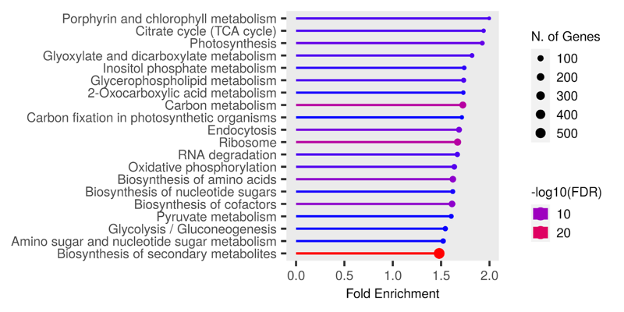
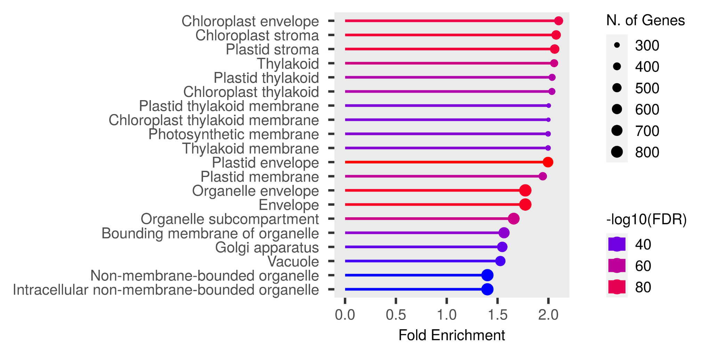
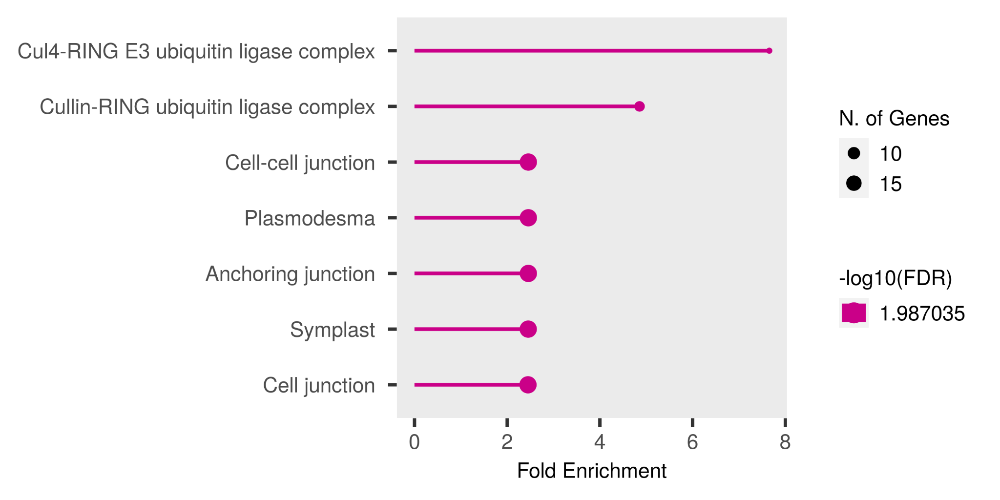

# Pathway results

(A)

(B)

**(C)**

**Figure XX2: (A)** Genome ontology analysis of GO molecular biology of all loci from all features. (B) GO cellular site summary for all features. (C) GO cellular site summary for feature 6.

