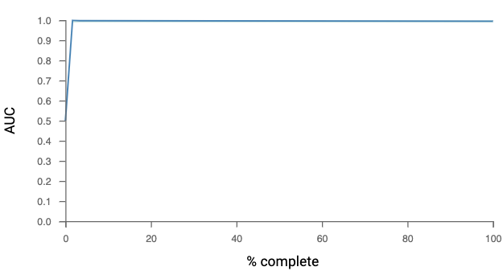
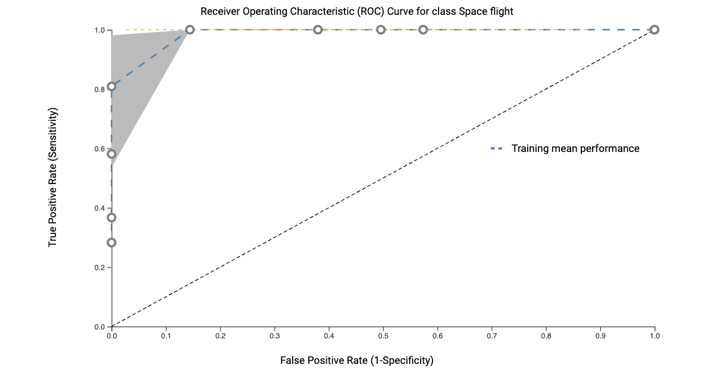

# Results (clean)

#### Variation in model performance for different factors 

The machine learning models produced 102 quantitative assessment metrics of distinct features within the model along with values describing the model’s mean performance and confidence values. Assessing these metrics (supplementary table XX2) shows that the precision, Mathew Correlation Coefficient (MCC) provides the “true positive rate”, it's sensitivity is adjusted to provide the average precision that performed best, this provides certainty in the models performance and is equivalent to chi-square statistics for a 2 x 2 contingency table. It is also interesting to note that the 2 factor groups that consistently had poor accuracy scores in each class of model were the “ambient air” and “control” classes (ranging from 0.44-0.55). This is likely due to the variability associated with these classes as they are meta-data values that exist within each experimental design regardless of the tissue or factor under investigation.

#### Ontology analysis of features provides biological insights into the MATRIX 

The JADBIo ML analysis identified 8 features within the matrix (supplementary table xx3). Feature  Pathway enrichment was conducted to gain insights into biological processes related to all features (loci), as well as specifically for feature 1 (8888 loci), feature 2 (10 loci) and feature 6 (222 loci). The precision model then identified another 3 distinct features each defined by a single loci and 2 features associated with 2 loci. So a total 1110 loci form the total combined model used in the ML feature recognition system. We used a false discovery rate (FDR) threshold of 0.01 to control for multiple testing effects while selecting significant pathways, ensuring high confidence in our findings. To generate statistical visualizations, we used ShinyGO (Ge et al., 2020), only considering pathways that had at least two members associated with them within our dataset. Due to the small size of the 4 monogenetic features and the 2 dual genetic feature they were analyzed collectively grouped with the other larger features.

**Learning progress during analysis:**

(A)

(B)

**Figure X1:** (A) The AUC curve shows the model gained 100% confidence after running 2% of the total number of machine learning algorithms tested. (B) The ROC curve visualizes the performance of a binary classifier. In a ROC curve the true positive rate (Sensitivity) is plotted against the false positive rate (1-Specificity) for different cut-off points.

