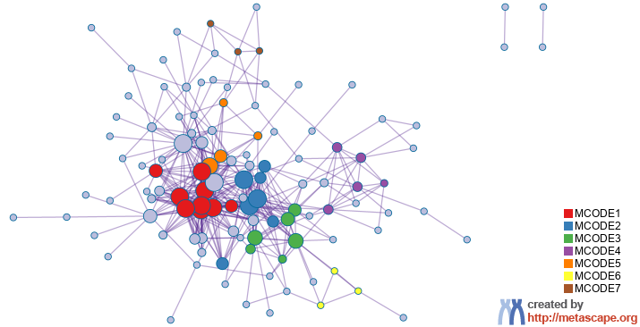

# Results Gene Prioritoisation by Evidence Counting (GPEC) "metascape"

**Kinase (cpk4) regulation of macromolecule production**

**Meta-scape GPEC analysis used to characterize “feature 6” / “Plasmodesmata”.**

<figure><figcaption></figcaption></figure>

**Supplementary Figure XXXXXX1:** Gene Prioritisation Evidence Counting (GPEC) of MCODE interaction network analysis of feature 6 contained 222 loci (supplementary table X) performed using metascape. MCODE identified 7 functional nodes.

**Supplementary Table XXXX1:** Ontology analysis of MCODE clusters identified by network analysis of 222 loci in PD “feature 6” using metascape gene prioritization evidence counting (GPEC) analysis.

| **GPEC group** | **GO**     | **Description**                                          | **Log10(P)** |
| -------------- | ---------- | -------------------------------------------------------- | ------------ |
| MCODE\_1       | GO:0004674 | Protein serine/threonine kinase activity                 | -2.9         |
| MCODE\_2       | GO:0010605 | Negative regulation of macromolecule metabolic process   | -3           |
| MCODE\_3       | GO:0140640 | Catalytic activity, acting on a nucleic acid             | -3.4         |
| MCODE\_4       | ath00620   | Pyruvate metabolism - Arabidopsis thaliana (thale cress) | -6           |
| MCODE\_4       | ath01200   | Carbon metabolism - Arabidopsis thaliana (thale cress)   | -4.6         |
| MCODE\_4       | GO:0032787 | Monocarboxylic acid metabolic process                    | -3.5         |
| MCODE\_6       | GO:0080008 | Cul4-RING E3 ubiquitin ligase complex                    | -6.7         |
| MCODE\_6       | GO:0031461 | Cullin-RING ubiquitin ligase complex                     | -6.3         |
| MCODE\_6       | GO:0000151 | Ubiquitin ligase complex                                 | -6.1         |
| MCODE\_network | GO:0046907 | Intracellular transport                                  | -6.7         |
| MCODE\_network | GO:0051649 | Establishment of localization in cell                    | -6.4         |
| MCODE\_network | GO:0031461 | Cullin-RING ubiquitin ligase complex                     | -5.5         |

