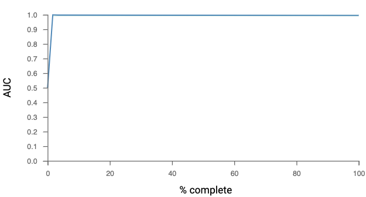
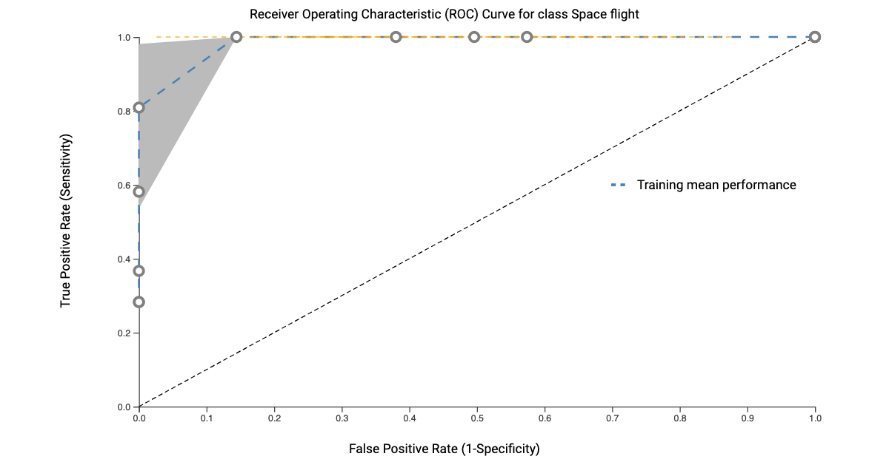

# Results

[Jadbio model performance and results in supplementary table](https://docs.google.com/spreadsheets/d/1f\_0TuJROgpQNYvMKF2Kr69cQbWZGzSNypwZlvdiX5AY/edit?usp=sharing)

**Learning process during analysis:**

The machine learning models produced 102 quantitative assessment metrics of distinct features within the model along with values describing the model’s mean performance and confidence values. Assessing these metrics (supplementary table XX2) shows that the precision, Mathew Correlation Coefficient (MCC) provides the “true positive rate”, it's sensitivity is adjusted to provide the average precision that performed best, this provides certainty in the model's performance and is equivalent to chi-square statistics for a 2 x 2 contingency table. It is also interesting to note that the 2 factor groups that consistently had poor accuracy scores in each class of the model were the “ambient air” and “control” classes (ranging from 0.44-0.55). This is likely due to the variability associated with these classes as they are meta-data values that exist within each experimental design regardless of the tissue or factor under investigation.

#### AUC and ROC curves. 

The JADBio ML platform incorporates sophisticated quality control metrics, including AUC (Area Under the Curve) and ROC (Receiver Operating Characteristic) curves, for the evaluation of binary classification models (Tsamardinos et al., 2022). These metrics are pivotal in discerning the predictive capability of such models.

The AUC metric, with a value range of 0 to 1, is a critical indicator of a model's proficiency in distinguishing between positive and negative classes. Optimal models demonstrate an AUC approaching 1, signifying superior performance, whereas an AUC of 0.5 implies no better discriminative ability than random chance. Notably, the AUC is unaffected by scale variations and remains consistent across different classification thresholds, providing a robust measure of a model's ranking capacity rather than its absolute predictions.

In parallel, the ROC curve graphically represents a model’s performance across varying thresholds, plotting the True Positive Rate (TPR) against the False Positive Rate (FPR). This analytical tool aids in evaluating a model's effectiveness in class separation, essentially distinguishing ‘signal’ from ‘noise’. The area under the ROC curve thus quantifies the overall success of binary classification algorithms.

Examination of the model’s AUC and ROC curves, as depicted in **Figure X1**, reveals an overfitting to the training datasets. This indicates a potential limitation in the model’s applicability to external datasets, albeit highlighting significant response nodes within the training sets themselves.

(A)

(B)

**Figure X1:** (A) The AUC curve shows the model gained 100% confidence after running 2% of the total number of machine learning algorithms tested. (B) The ROC curve visualizes the performance of a binary classifier. In a ROC curve the true positive rate (Sensitivity) is plotted against the false positive rate (1-Specificity) for different cut-off points.

#### Ontology analysis of features provides biological insights into the MATRIX 

<figure><figcaption></figcaption></figure>

The JADBIo ML analysis identified 8 features within the matrix (supplementary table xx3). Feature  Pathway enrichment was conducted to gain insights into biological processes related to all features (loci), as well as specifically for feature 1 (8888 loci), feature 2 (10 loci) and feature 6 (222 loci). The precision model then identified another 3 distinct features each defined by a single loci and 2 features associated with 2 loci. So a total 1110 loci form the total combined model used in the ML feature recognition system. We used a false discovery rate (FDR) threshold of 0.01 to control for multiple testing effects while selecting significant pathways, ensuring high confidence in our findings. To generate statistical visualizations, we used ShinyGO (Ge et al., 2020), only considering pathways that had at least two members associated with them within our dataset. Due to the small size of the 4 monogenetic features and the 2 dual genetic feature they were analyzed collectively grouped with the other larger features.

